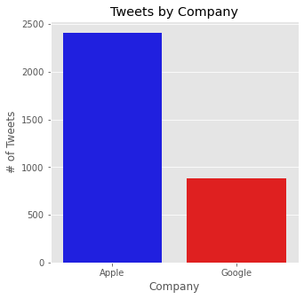
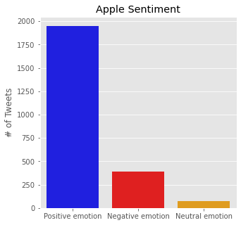
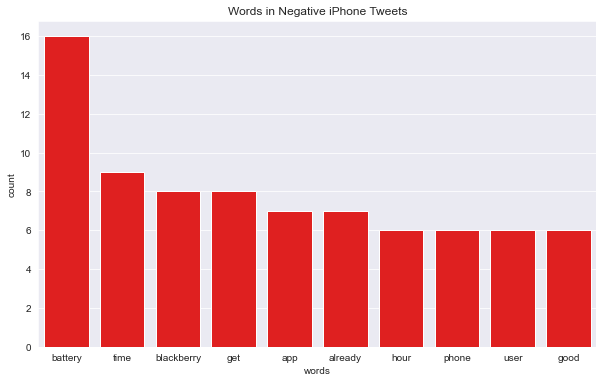
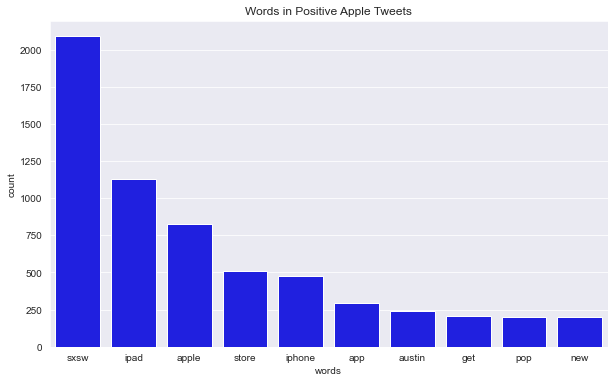
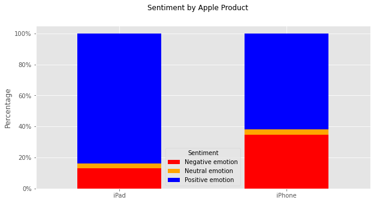

# Overview

The goal of this project is to perform a sentiment analysis of Apple customers, and uncover actionable insight that could be used to optimize a marketing strategy going forward. To achieve this, we built a predictive model using Natural Language Processing (NLP),  that could rate the sentiment of a tweet based on its content. At the end of our analysis, we present the findings of our model and provide concrete recommendations as to how Apple could improve its marketing strategy going forward and ultimately increase customer satisfaction. 

# Business Understanding 

Developing an excellent marketing strategy is crucial for an organization to consistently achieve positive results. To perform effective marketing, companies need to gain a deep understanding of their customers and uncover what matters to them most. The challenge is figuring out how to gain this insight in an efficient manner, and how to consistently implement meaningful change. Fortunately, machine learning provides us with unique and effective tools to perform customer sentiment analysis and guide long-term decision making. 

# Data Understanding

For our analysis we utilized the Brands & Product Emotions Dataset, which originally consisted of 9,093 entries. The attributes of this dataset included customer tweets, Apple and Google product types, and customer sentiment. For exploration purposes, we narrowed the dataset to all Apple and Google tweets that had a sentiment attached, which was 3,291 entries. In order to train our model to predict Apple customer sentiment based on future tweets, we needed to narrow our dataset so that it only contained Apple related customer tweets that had a sentiment attached to them. As a result, our final model was built from a dataset that contained 2,751 data  entries. 

